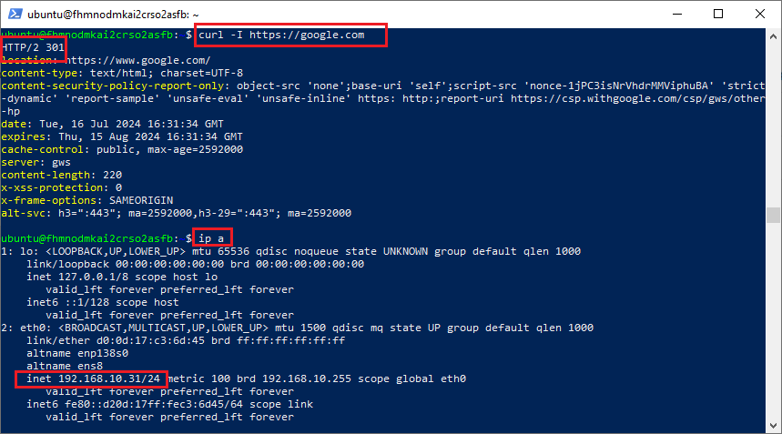
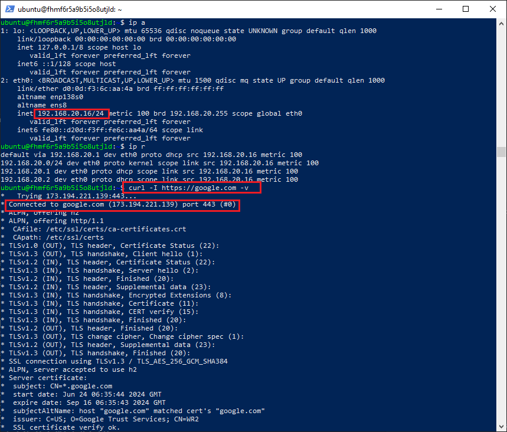

### Задание 1. Yandex Cloud 

**Что нужно сделать**

1. Создать пустую VPC. Выбрать зону.
2. Публичная подсеть.

 - Создать в VPC subnet с названием public, сетью 192.168.10.0/24.
 - Создать в этой подсети NAT-инстанс, присвоив ему адрес 192.168.10.254. В качестве image_id использовать fd80mrhj8fl2oe87o4e1.
 - Создать в этой публичной подсети виртуалку с публичным IP, подключиться к ней и убедиться, что есть доступ к интернету.
3. Приватная подсеть.
 - Создать в VPC subnet с названием private, сетью 192.168.20.0/24.
 - Создать route table. Добавить статический маршрут, направляющий весь исходящий трафик private сети в NAT-инстанс.
 - Создать в этой приватной подсети виртуалку с внутренним IP, подключиться к ней через виртуалку, созданную ранее, и убедиться, что есть доступ к интернету.

Resource Terraform для Yandex Cloud:

- [VPC subnet](https://registry.terraform.io/providers/yandex-cloud/yandex/latest/docs/resources/vpc_subnet).
- [Route table](https://registry.terraform.io/providers/yandex-cloud/yandex/latest/docs/resources/vpc_route_table).
- [Compute Instance](https://registry.terraform.io/providers/yandex-cloud/yandex/latest/docs/resources/compute_instance).

### Решение 1

#### Состав 

1. Манифест публичной ВМ находится в [файле](terraform/instance_publicvm.tf)
2. Манифест nat-инстанса находится в [файле](terraform/instance_nat.tf)
3. Манифест приватной ВМ находится в [файле](terraform/instance_privatevm.tf)

#### Переменные

|  Название переменной |   Тип   | Описание                                                                                                                               |
|----------------------|---------|----------------------------------------------------------------------------------------------------------------------------------------|
| default_zone         | string  |Зона сети. По умолчанию имеет значение **ru-central1-a**                                                                                |
| vpc_name             | string  | Название сети. По умолчанию имеет значение **develop**                                                                                 |
| vms_resources        | map     | Количество ядер, памяти, размеры и тип диска                                                                                           |
| token                | string  | Временный токен для подключения к консолю яндекс. Действует 24 часа. Чтобы получить новый используем команду ```yc iam create-token``` |
| public_key           | string  | Публичный ключ с указанием алгоритма шифрования. Чтобы сгенерировать пару ключей используем команду ```ssh-keygen -t ed25519```        |
| cloud_id             | string  | Идентификатор облака. В профиле устанавливается командой ```yc config set cloud-id <cloud-id>```                                       |
| folder_id            | string  | Идентификатор папки в облаке. В профиле устанавливается командой ```yc config set folder-id <cloud-id>```                              |  

#### Проверяем доступность интернета из публичной ВМ


 

#### Проверяем доступность интернета из приватной ВМ



#### Ключевая настройка

Для того чтобы таблица маршрутизации применилась её необходимо прописать в подсети.
Для этого в [файле манифеста сети](terraform/network.tf) в подсети **yandex_vpc_subnet.private** указывается  значение: ```route_table_id = yandex_vpc_route_table.route-table-nat.id``` и задается таблица маршрутизации с единственным статическим маршрутом связывающим приватную сеть с экземпляром NAT:
``` 
  resource "yandex_vpc_route_table" "route-table-nat" {
    name       = "route-table-nat"
    network_id = yandex_vpc_network.develop.id
    
    depends_on = [
        yandex_compute_instance.nat
    ]

    static_route {
        destination_prefix = local.cidr_internet
        next_hop_address   = yandex_compute_instance.nat.network_interface.0.ip_address
    } 
  }
```


---
### Задание 2. AWS* (задание со звёздочкой)

Это необязательное задание. Его выполнение не влияет на получение зачёта по домашней работе.

**Что нужно сделать**

1. Создать пустую VPC с подсетью 10.10.0.0/16.
2. Публичная подсеть.

 - Создать в VPC subnet с названием public, сетью 10.10.1.0/24.
 - Разрешить в этой subnet присвоение public IP по-умолчанию.
 - Создать Internet gateway.
 - Добавить в таблицу маршрутизации маршрут, направляющий весь исходящий трафик в Internet gateway.
 - Создать security group с разрешающими правилами на SSH и ICMP. Привязать эту security group на все, создаваемые в этом ДЗ, виртуалки.
 - Создать в этой подсети виртуалку и убедиться, что инстанс имеет публичный IP. Подключиться к ней, убедиться, что есть доступ к интернету.
 - Добавить NAT gateway в public subnet.
3. Приватная подсеть.
 - Создать в VPC subnet с названием private, сетью 10.10.2.0/24.
 - Создать отдельную таблицу маршрутизации и привязать её к private подсети.
 - Добавить Route, направляющий весь исходящий трафик private сети в NAT.
 - Создать виртуалку в приватной сети.
 - Подключиться к ней по SSH по приватному IP через виртуалку, созданную ранее в публичной подсети, и убедиться, что с виртуалки есть выход в интернет.

Resource Terraform:

1. [VPC](https://registry.terraform.io/providers/hashicorp/aws/latest/docs/resources/vpc).
1. [Subnet](https://registry.terraform.io/providers/hashicorp/aws/latest/docs/resources/subnet).
1. [Internet Gateway](https://registry.terraform.io/providers/hashicorp/aws/latest/docs/resources/internet_gateway).